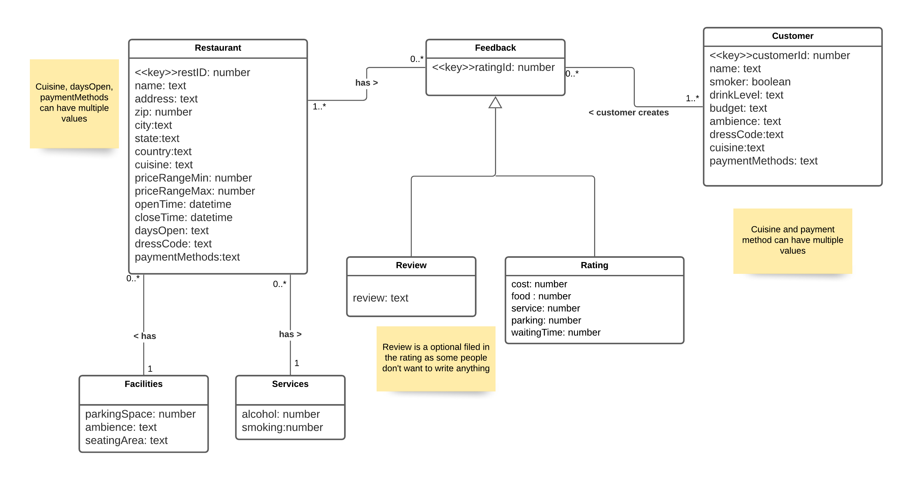
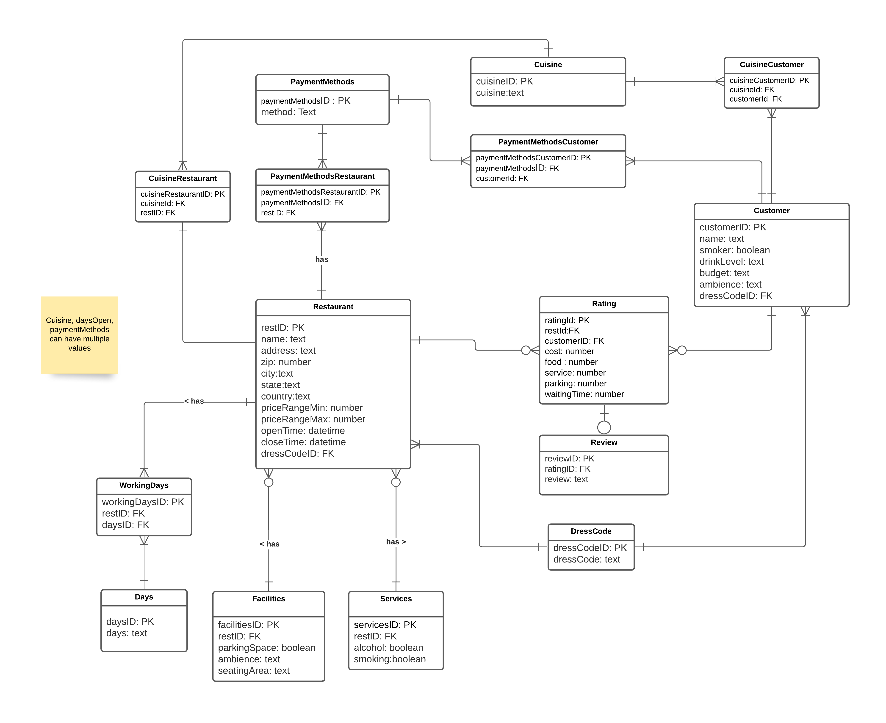

# CS5200-Project-I RestaurantReview Management
Project I / Design &amp; Implement a Relational Database

## Overview of Project
In this practicum you will build a database for a problem of your choice. You will describe the requirements for the project, build a conceptual data model, a logical data model, a relational schema, followed by implementing the relational schema in SQLite3, as well as a simple interface using Node.

## Format
You will be working in pairs for this project, but the submission must be made individually highlighting your contributions to all the tasks.
## Tasks
(10 pts) Describe the requirements of the problem with a simple document that lists the rules of the database in the problem domain language. Then describe a list of business rules and the list of possible nouns and actions you identified. I'm expecting this to be a short 1 or 2 pages document.

(15 pts) Analyze the problem and create a conceptual model in UML using a tool of your choice (e.g., LucidChart, Enterprise Architect, ArgoUML, Visual Paradigm, ERwin, TOAD) as discussed during class and provided in the references and resources below. Additional requirements and clarifications will be provided in the #general channel on Slack. The diagram must contain at least three classes, at least one to many relationship and one many to many. All relationships, except generalization, must have full multiplicity constraints and labeled as appropriate. Classes must have proper names, descriptions, and attributes with domain types. Key attributes and derived attributes must be marked. Don't build a model with more than 10 entities.

(10 pts) From the Conceptual Model, construct a logical data model expressed as an ERD using a language of your choice (other than UML) and a tool of your choice. The logical data model may not have any many-to-many relationships, so introduce association entities as needed.

(15 pts) From the logical model, define a relational schema in at least BCNF. Using functional dependencies, show that the schema in in at least BCNF.

(10 pts) Create a set of SQL data definition statements for the above model and realize that schema in SQLite3 by executing the script from the SQLite3, the console or Node. You can use DB Browser to generate these statements. Show that the tables were created and conform to the constraints through screen shots or other means.

(10 pts) Populate the tables with test data. You can use tools such as https://www.mockaroo.com/schemas (Links to an external site.) or  https://www.generatedata.com/ (Links to an external site.).

(10 pts) Define and execute at least five queries that show your database. At least one query must contain a join of at least three tables, one must contain a subquery, one must be a group by with a having clause, and one must contain a complex search criterion (more than one expression with logical connectors). Experiment with advanced query mechanisms such as RCTE, PARTITION BY, or SELECT CASE/WHEN.

(20 pts) Create a basic Node + Express application that let's you create, display, modify and delete at least two of the tables with a foreign key between then. No need to have a polished interface, and you can use the code created in class as a starting point

# Project proposal

@Emile Ferrand and @Misha Mody will be creating a Restaurant - Review Management System where Customers can search and query restaurants aligning to their preference and Restaurants can manage the Ratings/ Feedback and types of Customers they receive.

## @Misha Mody split would be:

- CRUD operations on the Restaurant Table
- CRUD operations on the Services and Facilities provided by the restaurant
- Query/filter restaurants based on name, food type, working hours, accepted payment methods, Facilities 

## @Emile Ferrand will be working on:

- CRUD operations on the customer table
- CRUD operation on the ratings provided by customer to the restaurant
- Query/filter reviews based on cost, service, parking, waiting time, and overall rating

# Documents:

- [project document .docx](./docs/CS5200%20project%201.docx)
- [project document .pdf](./docs/CS5200%20project%201.pdf)

# Conceptual Model:

# logical Model:

# SQL data definition statements:

- [Create table statements](./db/create.sql)

# Populate the tables with test data:

- [Database](./db/data.db)

# Made by
https://github.com/Misha-Mody

https://github.com/emile-f
